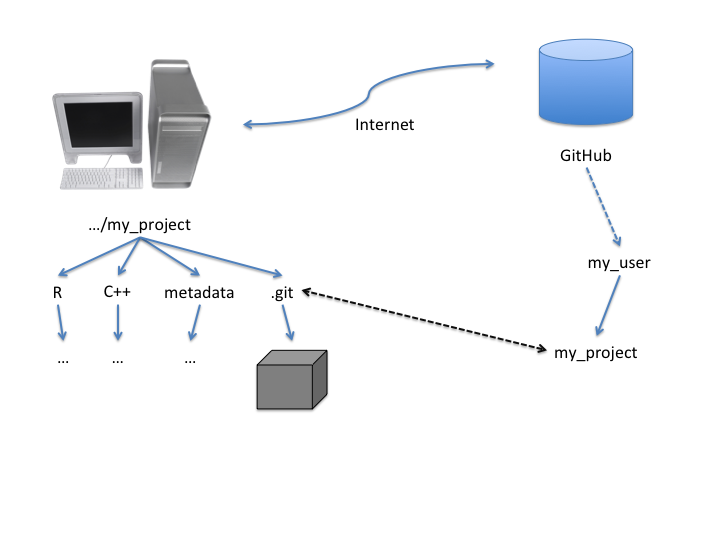
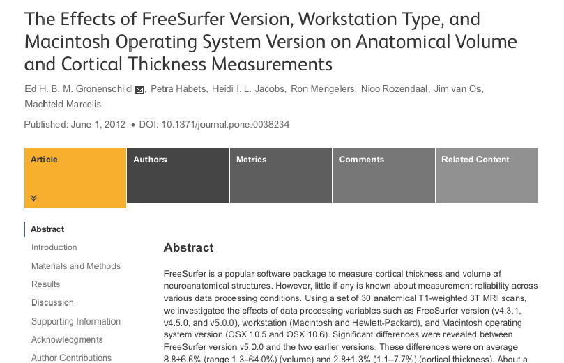

<style>
h2 { 
 color: #3399ff;		
}
h3 { 
 color: #3399ff;		
}
</style>


## Overview

- Is Excel (or Graphpad Prism or SeqMonk or ...) good enough?

- Basic tools for reproducible analyses (R, markdown and knitr)

- Managing your scripts and tracking revisions

- Reproducing the computational environment

## What's wrong with Excel (and similar)?

- *Insert Excel demo here...*

- *Now in R...*

```r
siCt <- read.table('sample_siCt.txt',header=TRUE)
for (i in 2:ncol(siCt)) {
  plot(siCt[,1],siCt[,i])
}
hist(siCt[,2],breaks=30)
```

## Plots in R

```{r plot_histo,echo=FALSE}
par(mfrow=c(2,2))
siCt <- read.table('sample_siCt.txt',header=TRUE)
for (i in 2:ncol(siCt)) {
  plot(siCt[,1],siCt[,i])
}
hist(siCt[,2],breaks=30)
```

## Scripting instead of clicking

- Reproducible

- Errors can be found and corrected

- Analysis can be re-run with added or different data

- Intersperse script and description (R, Python, Perl, etc)

## R, markdown and knitr demo

## Managing your project files: revision control

- Keep all human-written scripts, configuration files, metadata together

- Track changes automatically

- Tag the revision that is used for each main release of the analysis

- Avoid user error in change control

- Ease burden of coordination (if multiple people involved)

- One **_true_** master copy of each user-manipulated file

## Revision Control tools: Git

<center></center>

## Git commands

- `git clone git@github.com:gdbzork/my_project.git`
- `git add file1.txt file2.txt ...`
- `git status`
- `git commit -m 'descriptive message'`
- `git log file1.txt`
- `git branch release1`
- `git push origin master`

## Consistent file layout

Per-project folder, sub-folders

* `.../my_project`
    * `/R` -- knitr, sweave, etc scripts (*)
    * `/C++` -- C++ code, if applicable (or whatever languages) (*)
    * `/metadata` -- sample sheet(s), patient data, etc (*)
    * `/generated` -- anything created by your scripts
    * `/generated/peaks` -- ChIP-seq peaks, maybe?
    * `/generated/plots` -- generated figures
    * `/generated/tables` -- generated tables
    * `/raw_data` -- BAM files, maybe?

(*) Under revision control

## Reproducible environments

<center></center>

## Issues in Reproducing the Environment

1. operating system
#. compilers, system tools, R
#. versions of packages and/or libraries
    * availability
    * changes to interfaces
    * changes to algorithms

At a bare minimum, record the current environment

Ideally, use tools to recreate or preserve the environment

* *Docker*
* *EasyBuild* and *modules*

## R sessionInfo() example

```
> sessionInfo()
R version 3.2.0 (2015-04-16)
Platform: x86_64-unknown-linux-gnu (64-bit)
Running under: CentOS release 6.6 (Final)

locale:
[1] C

attached base packages:
 [1] grid      stats4    parallel  stats     graphics  grDevices utils    
 [8] datasets  methods   base     

other attached packages:
 [1] logging_0.7-103         affy_1.46.0             Biobase_2.28.0         
 [4] MASS_7.3-40             systemPipeR_1.2.1       RSQLite_1.0.0          
 [7] DBI_0.3.1               ShortRead_1.26.0        BiocParallel_1.2.2     
[10] XLConnect_0.2-11        XLConnectJars_0.2-9     gridExtra_0.9.1        
[13] ggplot2_1.0.1           GenomicAlignments_1.4.1 Rsamtools_1.20.2       
...
```
