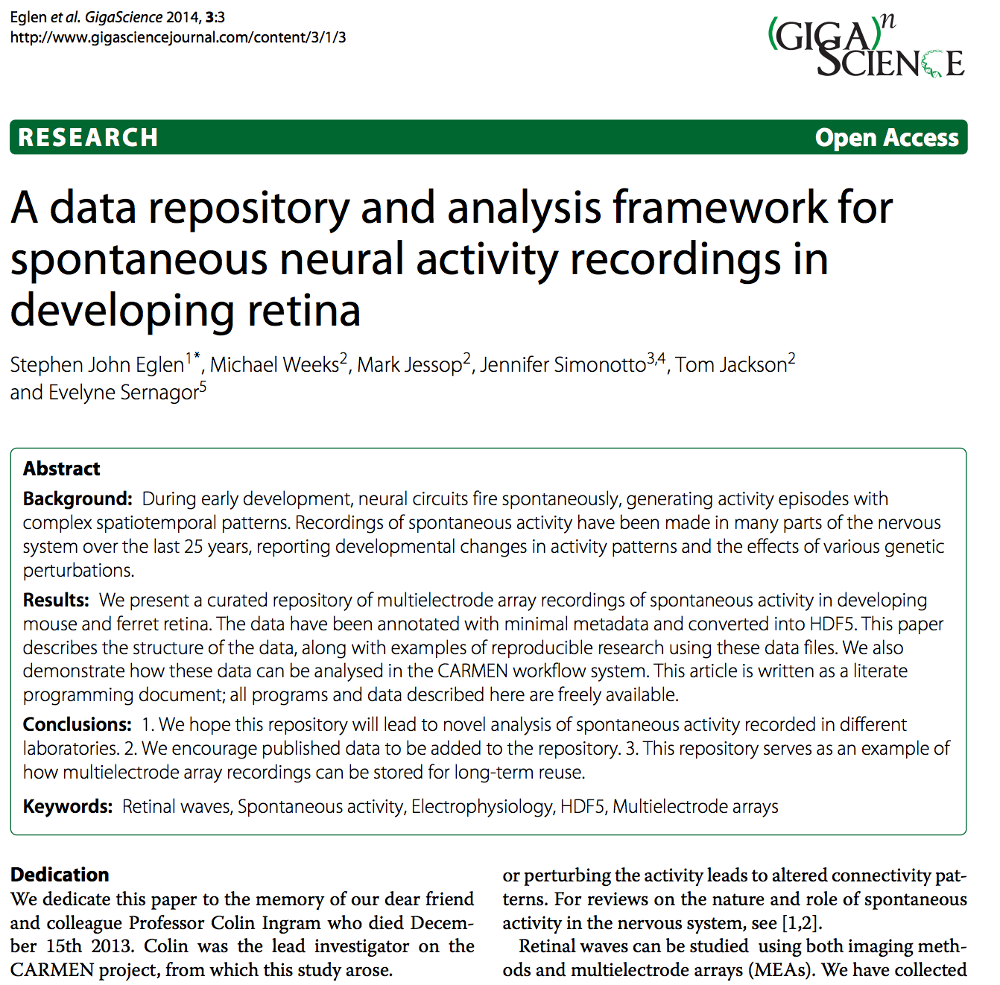
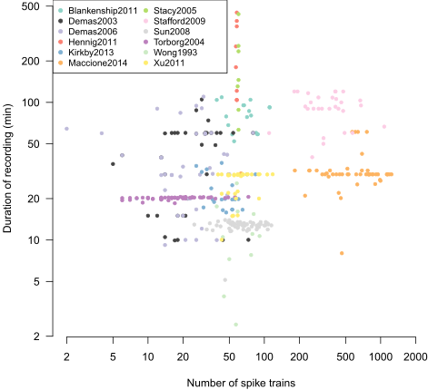

<style>
h2 { 
 color: #3399ff;		
}
h3 { 
 color: #3399ff;		
}
</style>


----

<center></center>

<!-- TODO: list items not rendered. -->
<div class="notes">
Started with a project 
European retina meeting 2007.
I will show what we have built and then a couple of _applications_
deriving immediately from it.
This is my *note*.
- It can contain markdown
- like this list
</div>

## What are retinal waves?

<center>
<video id="sampleMovie1" src="./figs/p11ctrlconv.mov" loop="true" autoplay="true" controls></video>
</center>


## What did we do?


- Requested retinal wave data from colleagues.

- Beta 2 knockout mouse was a key focus.

- Handled wide range of data formats.

- Determined what meta data is crucial.

- Converted to a common format . . .


## What is HDF5? | Hierarchical data format, version 5

- Scientific data format, useful across disciplines.
- Adopted recently by Matlab.
- All modern languages can read/write it.
- Native compression

- All meta data contained within the file.


## HDF5 example

<pre>
h5ls -r ~/proj/carmen/waverepo/waverepo/hdf5/Wong1993/Wong1993_P0.h5
/                        Group
/array                   Dataset {1}
/epos                    Dataset {2, 39}
/meta                    Group
/meta/age                Dataset {1}
/meta/key                Dataset {1}
/meta/species            Dataset {1}
/names                   Dataset {39}
/sCount                  Dataset {39}
/spikes                  Dataset {13336}
/summary                 Group
/summary/N               Dataset {1}
/summary/duration        Dataset {1}
/summary/frate           Dataset {39}
/summary/totalspikes     Dataset {1}
</pre>


## Datasets




----

<!-- ## Contents of "waverepo" |  (interactive)  -->

<iframe src="http://damtp.cam.ac.uk/user/sje30/waverepo"></iframe>


## Lessons learnt

- People were willing to give away their *published* data.

- Only one group could not find data to share.

- Test sets for data important.  How do you know you've got it right?
  
- Data papers can be well-received.  Media attention.

- Reproducible research takes a bit longer in the short-term, but
  should benefit in long-term.

- Designing *meta data* is hard.  This version was deliberately minimal
  and lasted approximately two months.
  

## Reproducible research is everywhere ...

... including these slides.  Made with markdown in R.  You can grab the
source from

https://github.com/bioinformatics-core-shared-training/rep-research-masterclass

and regenerate them in R with:

```
Rscript -e 'rmarkdown::render("neurocase1.Rmd")'
```
or see the `Makefile` rule to regenerate.

## Summary 

- Building repositories allows for reproducible research.

- Data papers are important and useful.

- Embedding meta data in files is the future.


More generally:

- Share your data

- Share your code

- Share your papers [http://biorxiv.org](http://biorxiv.org)


## Acknowledgements

- CARMEN project: (Evelyne Sernagor, Jennifer Simonotto, Mike Weeks, Mark
  Jessop, Tom Jackson) 

- Applications: Catherine Cutts, Ellese Cotterill, Paul Charlesworth,
  Seth Grant.

- Malin Sandström (INCF).
- Wellcome Trust, EPSRC, BBSRC.


<!-- TODO: problem when lines are not separated by blank line. -->
